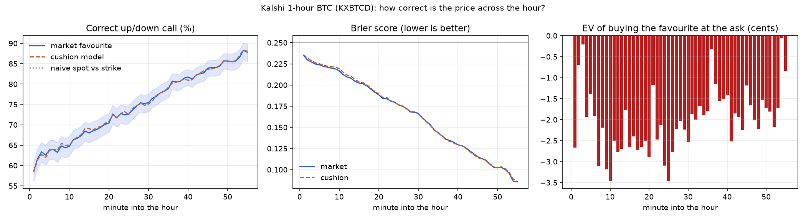

# 1-hour BTC (Kalshi KXBTCD) — study — 2026-10-03

1531 hourly windows (2026-07-27 → 2026-10-03), 10553 observations at minutes 1, 3, 4, 5, 15, 30, 45 (plus an every-minute accuracy curve from 79904 observations); fit 5261 / test 5292 (chronological), 69 days. The call = the ladder strike nearest the hour's open ('finish the hour above this level'). Not pre-registered.

## 1. At what point in the hour is the call most often correct?

Market favourite = the side Kalshi's price favours for the strike nearest the hour's open. Naive = spot above/below that strike. Cushion = the BTC model (kalshi-btc-agent). Brier: lower is better (0.25 = coin flip).

| minute | windows | market right [95% CI] | naive spot-vs-strike | cushion model | Brier market | Brier cushion | median cushion \|z\| | EV favourite @ ask |
|---|---|---|---|---|---|---|---|---|
| 1 | 1517 | 58.5% [56%–61%] | 58.4% | 58.4% | 0.2350 | 0.2359 | 0.16 | -2.67¢ |
| 2 | 1527 | 61.7% [59%–64%] | 61.4% | 61.4% | 0.2295 | 0.2315 | 0.19 | -0.69¢ |
| 3 | 1528 | 63.4% [61%–66%] | 62.7% | 62.7% | 0.2271 | 0.2289 | 0.23 | -0.21¢ |
| 4 | 1528 | 62.6% [60%–65%] | 61.9% | 61.9% | 0.2248 | 0.2262 | 0.25 | -1.93¢ |
| 5 | 1529 | 63.8% [61%–66%] | 63.7% | 63.7% | 0.2239 | 0.2250 | 0.27 | -1.40¢ |
| 10 | 1528 | 64.7% [62%–67%] | 65.0% | 65.0% | 0.2169 | 0.2194 | 0.34 | -3.47¢ |
| 15 | 1528 | 68.0% [66%–70%] | 69.0% | 69.0% | 0.2023 | 0.2039 | 0.42 | -2.65¢ |
| 20 | 1528 | 70.4% [68%–73%] | 70.8% | 70.8% | 0.1885 | 0.1895 | 0.51 | -2.90¢ |
| 25 | 1526 | 72.6% [70%–75%] | 72.5% | 72.5% | 0.1764 | 0.1767 | 0.60 | -3.47¢ |
| 30 | 1525 | 75.4% [73%–78%] | 75.1% | 75.1% | 0.1662 | 0.1665 | 0.69 | -2.52¢ |
| 35 | 1520 | 78.8% [77%–81%] | 79.1% | 79.1% | 0.1437 | 0.1434 | 0.82 | -1.79¢ |
| 40 | 1484 | 81.7% [80%–84%] | 80.9% | 80.9% | 0.1293 | 0.1294 | 0.97 | -1.41¢ |
| 45 | 1398 | 83.9% [82%–86%] | 83.6% | 83.6% | 0.1152 | 0.1142 | 1.08 | -1.18¢ |
| 50 | 1242 | 85.7% [84%–88%] | 85.7% | 85.7% | 0.1022 | 0.1022 | 1.22 | -1.73¢ |
| 55 | 887 | 87.8% [86%–90%] | 88.0% | 88.0% | 0.0858 | 0.0874 | 1.29 | -0.84¢ |

- Most accurate minutes (market): 54 (88.3%), 55 (87.8%), 53 (86.5%), 52 (85.7%), 49 (85.7%); least accurate: minute 1 (58.5%).
- Accuracy rises from 58.5% at minute 1 to 87.8% at minute 55, as less time is left for BTC to cross back over the strike.
- Where the market adds the most over the naive spot-vs-strike call: minute 40 (+0.8 pts), minute 31 (+0.7 pts), minute 3 (+0.7 pts).
- Best expected value buying the favourite at the ask: minute 54 (-0.1¢), minute 3 (-0.2¢), minute 36 (-0.3¢); worst: minute 25 (-3.5¢), minute 10 (-3.5¢), minute 9 (-3.2¢).



## 2. Cushion model, Chronos and AutoGluon vs. the market price (test half)

Percent of hours where each predictor's up/down call matched the settlement; 'vs market' = only-this-model-right / only-market-right, exact McNemar p.

| predictor | min 1 | min 3 | min 4 | min 5 | min 15 | min 30 | min 45 |
|---|---|---|---|---|---|---|---|
| market | **57.4%** | **60.7%** | **62.7%** | **63.3%** | **66.9%** | **75.4%** | **83.6%** |
| cushion | 56.2% | 59.9% | 62.4% | 63.4% | 68.2% | 74.6% | 82.9% |

\* differs from the market price at p < 0.05 (every starred model is worse unless noted in the JSON).

## 3. Is higher or lower volatility better for the call?

Slope = change in log-odds that the market favourite is right per +1 SD of log trailing 60-minute volatility (1-minute candles). 'Beyond cushion' also controls for how far price already is from the strike. CIs resample whole days.

| minute | windows | right: calm → volatile (quintile 1 → 5) | slope [95% CI] | beyond cushion [95% CI] | EV vs vol ρ [95% CI] | verdict |
|---|---|---|---|---|---|---|
| 1 | 1517 | 66.1% → 55.9% | -0.208 [-0.291, -0.111] | -0.032 [-0.125, +0.072] | +0.084 [+0.043, +0.128] | higher vol → LESS accurate |
| 3 | 1528 | 69.0% → 60.8% | -0.125 [-0.232, -0.011] | -0.020 [-0.140, +0.110] | +0.053 [-0.009, +0.120] | higher vol → LESS accurate |
| 4 | 1528 | 66.0% → 63.4% | -0.046 [-0.148, +0.076] | +0.103 [-0.006, +0.232] | +0.088 [+0.029, +0.143] | no clear effect |
| 5 | 1529 | 68.3% → 61.1% | -0.113 [-0.212, +0.007] | +0.000 [-0.111, +0.114] | +0.040 [-0.007, +0.089] | no clear effect |
| 15 | 1528 | 70.3% → 66.3% | -0.059 [-0.176, +0.033] | +0.056 [-0.059, +0.166] | -0.002 [-0.056, +0.050] | no clear effect |
| 30 | 1525 | 77.0% → 76.4% | -0.080 [-0.189, +0.051] | -0.013 [-0.133, +0.110] | -0.048 [-0.094, +0.001] | no clear effect |
| 45 | 1398 | 87.9% → 80.7% | -0.173 [-0.319, -0.054] | -0.134 [-0.328, +0.019] | -0.095 [-0.144, -0.043] | higher vol → LESS accurate |

All marks pooled, each volatility measure (1-, 3-, 4-, 5-minute candles and in-hour volatility):

| measure | slope [95% CI] | beyond cushion [95% CI] | EV vs vol ρ [95% CI] | top − bottom quintile |
|---|---|---|---|---|
| rv1 | -0.113 [-0.190, -0.023] | +0.021 [-0.050, +0.111] | +0.013 [-0.020, +0.049] | -6.4 pts |
| rv3 | -0.103 [-0.183, -0.011] | +0.021 [-0.053, +0.117] | +0.009 [-0.023, +0.044] | -5.9 pts |
| rv4 | -0.094 [-0.173, -0.003] | +0.022 [-0.051, +0.116] | +0.006 [-0.026, +0.040] | -4.3 pts |
| rv5 | -0.092 [-0.168, -0.003] | +0.018 [-0.054, +0.104] | +0.001 [-0.031, +0.037] | -5.2 pts |
| rv_win | -0.013 [-0.067, +0.055] | -0.037 [-0.093, +0.018] | -0.058 [-0.088, -0.022] | +0.5 pts |

Buying the market favourite at the ask, by volatility tercile (all marks):

| volatility | n | favourite right | avg ask | EV after fee |
|---|---|---|---|---|
| calm | 3518 | 70.8% | 0.691 | -0.13¢ |
| middle | 3517 | 66.2% | 0.670 | -2.65¢ |
| volatile | 3518 | 66.3% | 0.671 | -2.63¢ |

## 4. Gate calibration (the live agent's rule)

Call = the side the cushion model favours, only when its confidence clears the bar; `paid` = Kalshi ask for that side at that minute.

| min conf | fit n | fit hit [95% CI] | test n | test hit [95% CI] | test avg paid | test EV/contract |
|---|---|---|---|---|---|---|
| 0.60 | 3206 | 77.5% [76%–79%] | 3002 | 74.1% [73%–76%] | 0.75 | -0.025 |
| 0.70 | 1880 | 85.3% [84%–87%] | 1611 | 82.1% [80%–84%] | 0.83 | -0.024 |
| 0.80 | 1141 | 90.6% [89%–92%] | 884 | 91.2% [89%–93%] | 0.90 | +0.002 |
| 0.85 | 856 | 93.0% [91%–95%] | 654 | 94.0% [92%–96%] | 0.92 | +0.007 |
| 0.90 | 606 | 95.5% [94%–97%] | 461 | 96.1% [94%–98%] | 0.95 | +0.005 |
| 0.95 | 361 | 97.2% [95%–98%] | 276 | 96.4% [93%–98%] | 0.97 | -0.012 |
| 0.97 | 271 | 97.4% [95%–99%] | 195 | 97.9% [95%–99%] | 0.97 | -0.002 |
| 0.99 | 142 | 99.3% [96%–100%] | 101 | 97.0% [92%–99%] | 0.98 | -0.019 |

Chosen gate: **0.85** (lowest confidence with fit-half Wilson lower bound ≥ 90%, n ≥ 30).

By minute at the chosen gate (test half):

| minute | calls | hit | avg ask | EV/contract |
|---|---|---|---|---|
| 3 | 4 | 100.0% | 0.81 | +16.7¢ |
| 4 | 8 | 100.0% | 0.82 | +16.4¢ |
| 5 | 12 | 83.3% | 0.84 | -2.3¢ |
| 15 | 60 | 88.3% | 0.88 | -0.6¢ |
| 30 | 219 | 91.8% | 0.91 | -0.3¢ |
| 45 | 351 | 96.6% | 0.95 | +1.0¢ |

```json
{
  "min_conf": 0.85,
  "min_z": 1.04,
  "min_minute": 5,
  "hit_table": [
    {
      "conf_from": 0.5,
      "conf_to": 0.6,
      "n": 4345,
      "hit": 0.5579,
      "ci": [
        0.543,
        0.573
      ]
    },
    {
      "conf_from": 0.6,
      "conf_to": 0.7,
      "n": 2717,
      "hit": 0.6562,
      "ci": [
        0.638,
        0.674
      ]
    },
    {
      "conf_from": 0.7,
      "conf_to": 0.8,
      "n": 1466,
      "hit": 0.7408,
      "ci": [
        0.718,
        0.763
      ]
    },
    {
      "conf_from": 0.8,
      "conf_to": 0.9,
      "n": 958,
      "hit": 0.8539,
      "ci": [
        0.83,
        0.875
      ]
    },
    {
      "conf_from": 0.9,
      "conf_to": 0.95,
      "n": 430,
      "hit": 0.9419,
      "ci": [
        0.916,
        0.96
      ]
    },
    {
      "conf_from": 0.95,
      "conf_to": 0.98,
      "n": 279,
      "hit": 0.9534,
      "ci": [
        0.922,
        0.973
      ]
    },
    {
      "conf_from": 0.98,
      "conf_to": 1.0,
      "n": 358,
      "hit": 0.9804,
      "ci": [
        0.96,
        0.99
      ]
    }
  ],
  "sigma_proxy": 8.61,
  "calibrated_on": "1531 hourly windows to 2026-10-03",
  "calibrated_at": "2026-10-03T14:08:21Z"
}
```
