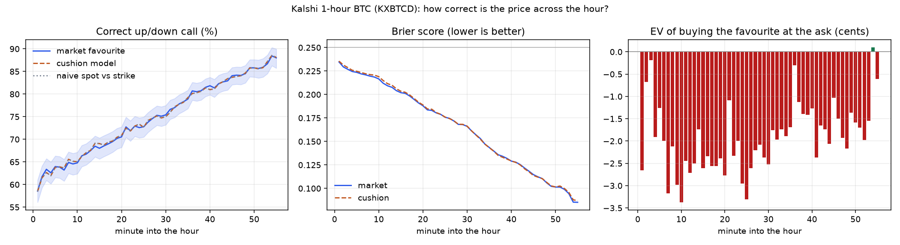

# 1-hour BTC (Kalshi KXBTCD) — study — 2026-10-04

1551 hourly windows (2026-07-27 → 2026-10-04), 10693 observations at minutes 1, 3, 4, 5, 15, 30, 45 (plus an every-minute accuracy curve from 80980 observations); fit 5330 / test 5363 (chronological), 70 days. The call = the ladder strike nearest the hour's open ('finish the hour above this level'). Not pre-registered.

## 1. At what point in the hour is the call most often correct?

Market favourite = the side Kalshi's price favours for the strike nearest the hour's open. Naive = spot above/below that strike. Cushion = the BTC model (kalshi-btc-agent). Brier: lower is better (0.25 = coin flip).

| minute | windows | market right [95% CI] | naive spot-vs-strike | cushion model | Brier market | Brier cushion | median cushion \|z\| | EV favourite @ ask |
|---|---|---|---|---|---|---|---|---|
| 1 | 1537 | 58.6% [56%–61%] | 58.5% | 58.5% | 0.2347 | 0.2355 | 0.16 | -2.65¢ |
| 2 | 1547 | 61.7% [59%–64%] | 61.5% | 61.5% | 0.2293 | 0.2313 | 0.19 | -0.68¢ |
| 3 | 1548 | 63.4% [61%–66%] | 62.7% | 62.7% | 0.2268 | 0.2286 | 0.23 | -0.19¢ |
| 4 | 1548 | 62.6% [60%–65%] | 62.0% | 62.0% | 0.2245 | 0.2258 | 0.25 | -1.91¢ |
| 5 | 1549 | 64.0% [62%–66%] | 63.8% | 63.8% | 0.2236 | 0.2247 | 0.27 | -1.26¢ |
| 10 | 1548 | 64.8% [62%–67%] | 65.1% | 65.1% | 0.2166 | 0.2190 | 0.34 | -3.37¢ |
| 15 | 1548 | 68.0% [66%–70%] | 69.1% | 69.1% | 0.2019 | 0.2035 | 0.42 | -2.61¢ |
| 20 | 1548 | 70.5% [68%–73%] | 70.9% | 70.9% | 0.1880 | 0.1889 | 0.51 | -2.77¢ |
| 25 | 1546 | 72.8% [70%–75%] | 72.6% | 72.6% | 0.1758 | 0.1759 | 0.60 | -3.31¢ |
| 30 | 1545 | 75.4% [73%–77%] | 75.0% | 75.0% | 0.1661 | 0.1663 | 0.69 | -2.52¢ |
| 35 | 1540 | 78.9% [77%–81%] | 79.2% | 79.2% | 0.1436 | 0.1434 | 0.82 | -1.69¢ |
| 40 | 1504 | 81.8% [80%–84%] | 81.0% | 81.0% | 0.1290 | 0.1292 | 0.97 | -1.27¢ |
| 45 | 1418 | 84.1% [82%–86%] | 83.7% | 83.7% | 0.1146 | 0.1137 | 1.08 | -1.03¢ |
| 50 | 1260 | 85.8% [84%–88%] | 85.8% | 85.8% | 0.1015 | 0.1016 | 1.22 | -1.59¢ |
| 55 | 901 | 88.0% [86%–90%] | 88.1% | 88.1% | 0.0852 | 0.0870 | 1.29 | -0.61¢ |

- Most accurate minutes (market): 54 (88.4%), 55 (88.0%), 53 (86.7%), 52 (85.9%), 49 (85.8%); least accurate: minute 1 (58.6%).
- Accuracy rises from 58.6% at minute 1 to 88.0% at minute 55, as less time is left for BTC to cross back over the strike.
- Where the market adds the most over the naive spot-vs-strike call: minute 40 (+0.9 pts), minute 3 (+0.7 pts), minute 31 (+0.6 pts).
- Best expected value buying the favourite at the ask: minute 54 (+0.1¢), minute 3 (-0.2¢), minute 36 (-0.3¢); worst: minute 10 (-3.4¢), minute 25 (-3.3¢), minute 7 (-3.2¢).



## 2. Cushion model, Chronos and AutoGluon vs. the market price (test half)

Percent of hours where each predictor's up/down call matched the settlement; 'vs market' = only-this-model-right / only-market-right, exact McNemar p.

| predictor | min 1 | min 3 | min 4 | min 5 | min 15 | min 30 | min 45 |
|---|---|---|---|---|---|---|---|
| market | **57.4%** | **60.9%** | **62.6%** | **63.5%** | **67.1%** | **75.2%** | **83.9%** |
| cushion | 56.4% | 60.0% | 62.2% | 63.5% | 68.4% | 74.4% | 83.0% |

\* differs from the market price at p < 0.05 (every starred model is worse unless noted in the JSON).

## 3. Is higher or lower volatility better for the call?

Slope = change in log-odds that the market favourite is right per +1 SD of log trailing 60-minute volatility (1-minute candles). 'Beyond cushion' also controls for how far price already is from the strike. CIs resample whole days.

| minute | windows | right: calm → volatile (quintile 1 → 5) | slope [95% CI] | beyond cushion [95% CI] | EV vs vol ρ [95% CI] | verdict |
|---|---|---|---|---|---|---|
| 1 | 1537 | 66.6% → 55.8% | -0.205 [-0.312, -0.101] | -0.026 [-0.130, +0.083] | +0.085 [+0.034, +0.129] | higher vol → LESS accurate |
| 3 | 1548 | 68.4% → 61.3% | -0.123 [-0.217, -0.013] | -0.016 [-0.122, +0.092] | +0.054 [-0.001, +0.113] | higher vol → LESS accurate |
| 4 | 1548 | 65.8% → 62.9% | -0.043 [-0.140, +0.075] | +0.108 [-0.005, +0.225] | +0.088 [+0.036, +0.142] | no clear effect |
| 5 | 1549 | 67.7% → 60.6% | -0.120 [-0.205, -0.016] | -0.007 [-0.107, +0.087] | +0.037 [-0.003, +0.079] | higher vol → LESS accurate |
| 15 | 1548 | 70.3% → 66.5% | -0.063 [-0.159, +0.037] | +0.051 [-0.070, +0.168] | -0.004 [-0.061, +0.050] | no clear effect |
| 30 | 1545 | 78.0% → 76.1% | -0.077 [-0.190, +0.043] | -0.007 [-0.123, +0.124] | -0.047 [-0.096, -0.000] | no clear effect |
| 45 | 1418 | 88.7% → 80.6% | -0.187 [-0.321, -0.051] | -0.146 [-0.304, +0.022] | -0.097 [-0.138, -0.043] | higher vol → LESS accurate |

All marks pooled, each volatility measure (1-, 3-, 4-, 5-minute candles and in-hour volatility):

| measure | slope [95% CI] | beyond cushion [95% CI] | EV vs vol ρ [95% CI] | top − bottom quintile |
|---|---|---|---|---|
| rv1 | -0.115 [-0.189, -0.036] | +0.021 [-0.059, +0.106] | +0.012 [-0.019, +0.043] | -6.3 pts |
| rv3 | -0.104 [-0.178, -0.026] | +0.020 [-0.052, +0.103] | +0.008 [-0.021, +0.038] | -5.6 pts |
| rv4 | -0.095 [-0.168, -0.015] | +0.022 [-0.048, +0.103] | +0.006 [-0.023, +0.037] | -4.7 pts |
| rv5 | -0.093 [-0.163, -0.011] | +0.018 [-0.053, +0.098] | +0.001 [-0.029, +0.031] | -5.3 pts |
| rv_win | -0.014 [-0.072, +0.059] | -0.039 [-0.098, +0.010] | -0.058 [-0.092, -0.028] | +0.3 pts |

Buying the market favourite at the ask, by volatility tercile (all marks):

| volatility | n | favourite right | avg ask | EV after fee |
|---|---|---|---|---|
| calm | 3565 | 70.9% | 0.690 | +0.02¢ |
| middle | 3564 | 66.2% | 0.671 | -2.67¢ |
| volatile | 3564 | 66.3% | 0.671 | -2.58¢ |

## 4. Gate calibration (the live agent's rule)

Call = the side the cushion model favours, only when its confidence clears the bar; `paid` = Kalshi ask for that side at that minute.

| min conf | fit n | fit hit [95% CI] | test n | test hit [95% CI] | test avg paid | test EV/contract |
|---|---|---|---|---|---|---|
| 0.60 | 3241 | 77.4% [76%–79%] | 3055 | 74.5% [73%–76%] | 0.75 | -0.020 |
| 0.70 | 1903 | 85.2% [84%–87%] | 1641 | 82.4% [81%–84%] | 0.83 | -0.019 |
| 0.80 | 1155 | 90.6% [89%–92%] | 904 | 91.6% [90%–93%] | 0.90 | +0.008 |
| 0.85 | 866 | 92.8% [91%–94%] | 668 | 94.5% [92%–96%] | 0.92 | +0.013 |
| 0.90 | 612 | 95.6% [94%–97%] | 471 | 96.2% [94%–98%] | 0.94 | +0.007 |
| 0.95 | 366 | 97.3% [95%–99%] | 281 | 96.4% [94%–98%] | 0.96 | -0.010 |
| 0.97 | 275 | 97.5% [95%–99%] | 198 | 98.0% [95%–99%] | 0.97 | -0.001 |
| 0.99 | 144 | 99.3% [96%–100%] | 104 | 97.1% [92%–99%] | 0.98 | -0.018 |

Chosen gate: **0.85** (lowest confidence with fit-half Wilson lower bound ≥ 90%, n ≥ 30).

By minute at the chosen gate (test half):

| minute | calls | hit | avg ask | EV/contract |
|---|---|---|---|---|
| 3 | 5 | 100.0% | 0.81 | +16.8¢ |
| 4 | 10 | 100.0% | 0.81 | +17.6¢ |
| 5 | 13 | 84.6% | 0.83 | -0.0¢ |
| 15 | 59 | 89.8% | 0.88 | +1.0¢ |
| 30 | 224 | 92.4% | 0.91 | +0.6¢ |
| 45 | 357 | 96.6% | 0.95 | +1.1¢ |

```json
{
  "min_conf": 0.85,
  "min_z": 1.04,
  "min_minute": 5,
  "hit_table": [
    {
      "conf_from": 0.5,
      "conf_to": 0.6,
      "n": 4397,
      "hit": 0.5567,
      "ci": [
        0.542,
        0.571
      ]
    },
    {
      "conf_from": 0.6,
      "conf_to": 0.7,
      "n": 2752,
      "hit": 0.657,
      "ci": [
        0.639,
        0.674
      ]
    },
    {
      "conf_from": 0.7,
      "conf_to": 0.8,
      "n": 1485,
      "hit": 0.7414,
      "ci": [
        0.719,
        0.763
      ]
    },
    {
      "conf_from": 0.8,
      "conf_to": 0.9,
      "n": 976,
      "hit": 0.8566,
      "ci": [
        0.833,
        0.877
      ]
    },
    {
      "conf_from": 0.9,
      "conf_to": 0.95,
      "n": 436,
      "hit": 0.9427,
      "ci": [
        0.917,
        0.961
      ]
    },
    {
      "conf_from": 0.95,
      "conf_to": 0.98,
      "n": 284,
      "hit": 0.9542,
      "ci": [
        0.923,
        0.973
      ]
    },
    {
      "conf_from": 0.98,
      "conf_to": 1.0,
      "n": 363,
      "hit": 0.9807,
      "ci": [
        0.961,
        0.991
      ]
    }
  ],
  "sigma_proxy": 8.61,
  "calibrated_on": "1551 hourly windows to 2026-10-04",
  "calibrated_at": "2026-10-04T10:51:54Z"
}
```
